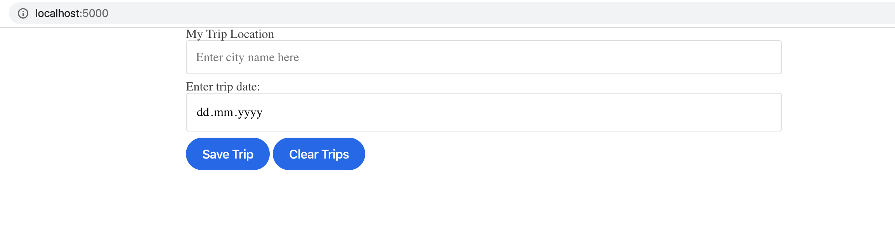

## Project overview

Front End Development Nanodegree - Capstone Project - Travel App

## Description

User provides a travel city and a travel date



The app will return the weather forecast to location on the trip date and an image from the trip location.

The user can search for more trips, and use the "Clear Trips" button to remove all of the saved trips.

## Getting started

Clone the project on your local machine

`git clone https://github.com/radutheodor/fend-capstone.git`

Make sure you have at least `node v 10+` installed

```
$ node -v
v13.10.1
```

and run the following commands in the command line

```javascript
npm i // installs all needed dependencies
npm run build-prod // creates the /dist folder for production mode
npm run start // starts the express server
```

and finally open the app in browser as described below

### Open the app

:link: [http://localhost:5000](http://localhost:5000)
:open_file_folder: webpack.prod.conf

## To do

- [ ] add static code analyzer
- [ ] add CI and deployment i.e. using Travis and Heroku
- [ ] add possibility to remove individual trips
- [ ] allow users to enter multiple destinations in the same trip
- [ ] pull forecast for multiple days and add icons to forecast
- [ ] allow user to add a todo list

## Contact

:mailbox_with_mail: theo.registrations@icloud.com
